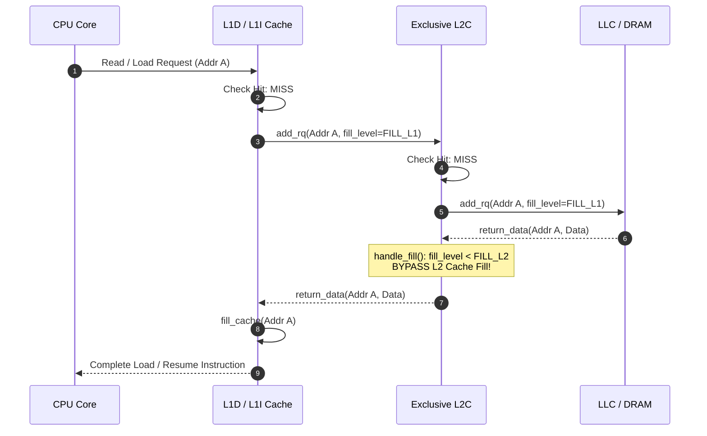
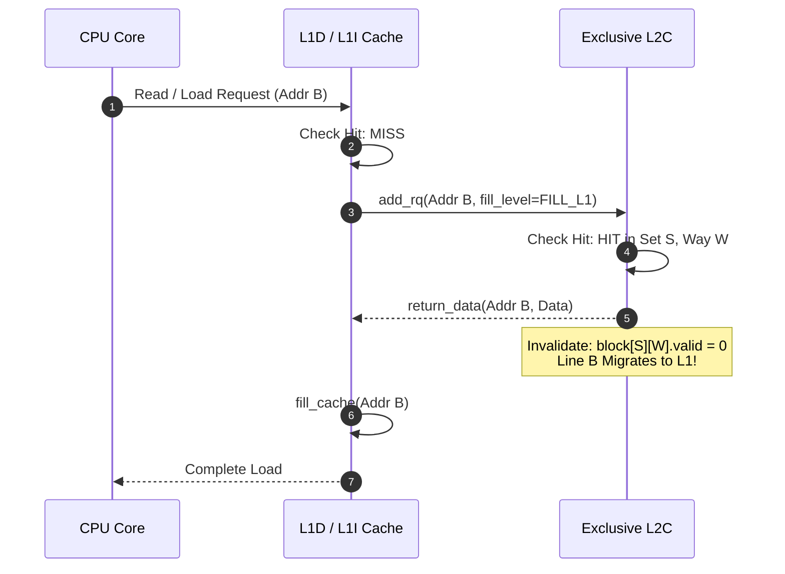
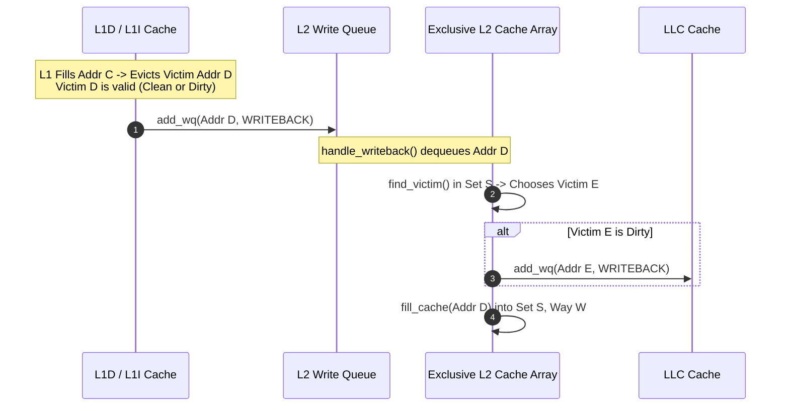

# CS683: Exclusive Cache Hierarchy in ChampSim

[]()
[]()
[]()
[]()

This repository contains a complete, verified implementation of an **Exclusive Cache Hierarchy** for the **ChampSim** trace-based microarchitectural simulator (CS683: Advanced Computer Architecture, IIT Bombay).

---

## Table of Contents
1. [Overview & Motivation](#overview--motivation)
2. [Inclusive vs. Non-Inclusive vs. Exclusive Cache](#inclusive-vs-non-inclusive-vs-exclusive-cache)
3. [Exclusive Cache Architecture](#exclusive-cache-architecture)
4. [Microarchitectural Implementation Details](#microarchitectural-implementation-details)
   - [1. L2C Fill Bypass on L1 Demand Misses](#1-l2c-fill-bypass-on-l1-demand-misses)
   - [2. Line Invalidation on L2C Hits](#2-line-invalidation-on-l2c-hits)
   - [3. L1 Victim Eviction Policy (Clean & Dirty)](#3-l1-victim-eviction-policy-clean--dirty)
   - [4. Write Queue Forwarding & Race Cleanup](#4-write-queue-forwarding--race-cleanup)
   - [5. Exclusivity Verification (`-DEXCLUSIVITY_CHECK`)](#5-exclusivity-verification--dexclusivity_check)
5. [Operational Flowcharts & Sequence Diagrams](#operational-flowcharts--sequence-diagrams)
6. [Empirical Evaluation & Performance Analysis](#empirical-evaluation--performance-analysis)
7. [Build & Simulation Guide](#build--simulation-guide)
8. [Repository Structure](#repository-structure)

---

## Overview & Motivation

In modern multi-level cache hierarchies, managing how cache lines are duplicated or partitioned across levels significantly impacts effective capacity and miss latency:

- **Inclusive Caches**: Outer levels (e.g., L2 or LLC) strictly maintain a superset of all lines in inner levels (L1). While simplify coherence snooping, inclusion wastes substantial capacity by duplicating data across cache levels.
- **Non-Inclusive Caches**: Lines brought from memory are placed in all intermediate levels, but eviction at one level does not force invalidation at others. Duplication still occurs naturally on every demand fill.
- **Exclusive Caches**: A cache line exists in **at most one** cache level at any given time. The aggregate cache capacity is maximized:
  $$\text{Effective Capacity} = \text{Capacity}(L1I) + \text{Capacity}(L1D) + \text{Capacity}(L2C)$$
  In this paradigm, L2 serves as a **victim cache** for L1, capturing blocks evicted from L1.

```
       +-------------------------------------------------------------+
       |               INCLUSIVE vs. EXCLUSIVE CACHES                |
       +-------------------------------------------------------------+
       |  INCLUSIVE CACHE:                                           |
       |     L1 Cache:  [ A ] [ B ] [ C ]                            |
       |     L2 Cache:  [ A ] [ B ] [ C ] [ D ] [ E ] [ F ]          |
       |     --> Duplication of {A, B, C} reduces effective capacity |
       +-------------------------------------------------------------+
       |  EXCLUSIVE CACHE:                                           |
       |     L1 Cache:  [ A ] [ B ] [ C ]                            |
       |     L2 Cache:  [ D ] [ E ] [ F ] [ G ] [ H ] [ I ]          |
       |     --> Zero overlap: Aggregate Capacity = L1 + L2          |
       +-------------------------------------------------------------+
```

---

## Inclusive vs. Non-Inclusive vs. Exclusive Cache

| Metric / Behavior | Inclusive Cache | Non-Inclusive (NINE) | Exclusive Cache (This Work) |
| :--- | :--- | :--- | :--- |
| **Data Placement on Miss** | Filled in L1, L2, LLC | Filled in L1, L2, LLC | Filled **only in L1** (bypasses L2) |
| **Data on L2 Read Hit** | Retained in L2 & copied to L1 | Retained in L2 & copied to L1 | **Invalidated in L2**; moved to L1 |
| **L1 Eviction Policy** | Discard clean; writeback dirty | Discard clean; writeback dirty | **All valid victims (clean & dirty)** pushed to L2 |
| **L2 Eviction Policy** | Back-invalidation to L1 | Discard clean; writeback dirty | Writeback dirty victims to LLC |
| **Aggregate Capacity** | Equal to L2 size ($C_{L2}$) | Between $C_{L2}$ and $C_{L1} + C_{L2}$ | **Strictly $C_{L1} + C_{L2}$** |

---

## Exclusive Cache Architecture

```mermaid
graph TD
    CPU["CPU Core / Instruction Pipeline"] -->|Instruction Fetch| L1I["L1 Instruction Cache (32 KB, 8-way)"]
    CPU -->|Data Load / Store / RFO| L1D["L1 Data Cache (48 KB, 12-way)"]
    
    L1I -.->|Evicted Victims (Clean/Dirty)| L2_WQ["L2 Write Queue (WQ)"]
    L1D -.->|Evicted Victims (Clean/Dirty)| L2_WQ
    
    L1I -->|Demand Miss (fill_level=FILL_L1)| L2_RQ["L2 Read Queue (RQ)"]
    L1D -->|Demand Miss (fill_level=FILL_L1)| L2_RQ
    
    subgraph "Exclusive L2 Subsystem (512 KB, 8-way Unified)"
        L2_WQ --> L2_CORE["L2 Cache Controller & Block Array"]
        L2_RQ --> L2_CORE
        L2_CORE -->|L2 Hit: Invalidate & Return Data| L1D
        L2_CORE -->|L2 Hit: Invalidate & Return Data| L1I
    end
    
    L2_CORE -.->|L2 Victim Writeback| LLC_WQ["LLC Write Queue"]
    L2_CORE -->|L2 Miss: Bypass Fill & Forward| LLC_RQ["LLC Read Queue"]
    
    subgraph "Last Level Cache (LLC) & Memory"
        LLC_WQ --> LLC["LLC (2 MB / core, 16-way)"]
        LLC_RQ --> LLC
        LLC --> DRAM["Main Memory (DRAM)"]
    end
```

---

## Microarchitectural Implementation Details

The exclusive cache implementation is encapsulated in [`cache_hierarchies/exclusive_cache.cc`](file:///home/neel/Desktop/assignments/architecture/Assignment2/cache_hierarchies/exclusive_cache.cc).

### 1. L2C Fill Bypass on L1 Demand Misses
When a cache miss occurs at L1, L1 issues a read request down to L2 with `fill_level = FILL_L1`. If L2 also misses, the request propagates to LLC/DRAM. When data arrives at L2 via MSHR:
- **In non-inclusive cache**, L2 allocates a way, evicts a victim if needed, and fills the line into L2.
- **In exclusive cache**, L2 detects that `MSHR.entry.fill_level < fill_level` (`FILL_L1 < FILL_L2`), bypasses cache array insertion, forwards the data directly to the requesting upper-level cache (`upper_level_icache` or `upper_level_dcache`), and terminates the MSHR entry.

```cpp
// cache_hierarchies/exclusive_cache.cc: handle_fill()
if (cache_type == IS_L2C && MSHR.entry[mshr_index].fill_level < fill_level)
{
    if (MSHR.entry[mshr_index].type == LOAD_TRANSLATION || 
        MSHR.entry[mshr_index].type == PREFETCH_TRANSLATION || 
        MSHR.entry[mshr_index].type == TRANSLATION_FROM_L1D)
    {
        extra_interface->return_data(&MSHR.entry[mshr_index]);
    }
    else
    {
        if (MSHR.entry[mshr_index].send_both_cache) {
            upper_level_icache[fill_cpu]->return_data(&MSHR.entry[mshr_index]);
            upper_level_dcache[fill_cpu]->return_data(&MSHR.entry[mshr_index]);
        }
        else if (MSHR.entry[mshr_index].fill_l1i || MSHR.entry[mshr_index].fill_l1d) {
            if (MSHR.entry[mshr_index].fill_l1i)
                upper_level_icache[fill_cpu]->return_data(&MSHR.entry[mshr_index]);
            if (MSHR.entry[mshr_index].fill_l1d)
                upper_level_dcache[fill_cpu]->return_data(&MSHR.entry[mshr_index]);
        }
        else if (MSHR.entry[mshr_index].instruction)
            upper_level_icache[fill_cpu]->return_data(&MSHR.entry[mshr_index]);
        else if (MSHR.entry[mshr_index].is_data)
            upper_level_dcache[fill_cpu]->return_data(&MSHR.entry[mshr_index]);
    }

    // Update stats and latency
    sim_miss[fill_cpu][MSHR.entry[mshr_index].type]++;
    sim_access[fill_cpu][MSHR.entry[mshr_index].type]++;

    MSHR.remove_queue(&MSHR.entry[mshr_index]);
    MSHR.num_returned--;
    update_fill_cycle();
    return; // Bypass L2 fill
}
```

---

### 2. Line Invalidation on L2C Hits
When an L1 demand or prefetch request hits in L2 (`way >= 0`), L2 returns the data to L1. Since the block is moving to L1, L2 must invalidate its local copy:

```cpp
// cache_hierarchies/exclusive_cache.cc: handle_read() & handle_prefetch()
else if (cache_type == IS_L2C)
{
    // Return data to upper level
    if (RQ.entry[index].instruction)
        upper_level_icache[read_cpu]->return_data(&RQ.entry[index]);
    else if (RQ.entry[index].is_data)
        upper_level_dcache[read_cpu]->return_data(&RQ.entry[index]);

    // EXCLUSIVE CACHE: Invalidate line in L2C since it migrated to L1
    if (RQ.entry[index].fill_level < fill_level) {
        block[set][way].valid = 0;
    }
}
```

---

### 3. L1 Victim Eviction Policy (Clean & Dirty)
In a non-inclusive cache, clean victims are discarded because L2 already has a copy. In an exclusive cache, L2 does not hold a copy while the line is in L1. Thus, **every valid victim (clean or dirty)** evicted from L1 must be pushed down to L2's Write Queue (`WQ`):

```cpp
// cache_hierarchies/exclusive_cache.cc: handle_fill() in L1
bool need_writeback = false;
if (cache_type == IS_L1D || cache_type == IS_L1I) {
    need_writeback = (block[set][way].valid == 1); // Push both clean & dirty victims
} else {
    need_writeback = (block[set][way].dirty == 1); // Lower levels write back dirty lines
}

if (need_writeback) {
    if (lower_level) {
        if (lower_level->get_occupancy(2, block[set][way].address) == lower_level->get_size(2, block[set][way].address)) {
            do_fill = 0; // Stall fill until WQ has available capacity
            lower_level->increment_WQ_FULL(block[set][way].address);
            STALL[MSHR.entry[mshr_index].type]++;
        } else {
            PACKET writeback_packet;
            writeback_packet.fill_level = fill_level << 1;
            writeback_packet.cpu = fill_cpu;
            writeback_packet.address = block[set][way].address;
            writeback_packet.full_addr = block[set][way].full_addr;
            writeback_packet.data = block[set][way].data;
            writeback_packet.instr_id = MSHR.entry[mshr_index].instr_id;
            writeback_packet.type = WRITEBACK;
            writeback_packet.event_cycle = current_core_cycle[fill_cpu];
            if (block[set][way].instruction)
                writeback_packet.instruction = 1;

            lower_level->add_wq(&writeback_packet);
        }
    }
}
```

---

### 4. Write Queue Forwarding & Race Cleanup
If an L1 read arrives for a line that was recently evicted and is still queued in L2's `WQ`, WQ forwarding services the request to L1. To prevent L2 from subsequently allocating this block when `handle_writeback()` executes, the pending entry is removed from L2's `WQ`:

```cpp
// cache_hierarchies/exclusive_cache.cc: add_rq() & add_pq()
if (packet->fill_level < fill_level) {
    packet->data = WQ.entry[wq_index].data;
    if (fill_level == FILL_L2) {
        if (packet->fill_l1i) upper_level_icache[packet->cpu]->return_data(packet);
        if (packet->fill_l1d) upper_level_dcache[packet->cpu]->return_data(packet);

        // EXCLUSIVE CACHE: Dequeue pending writeback to prevent duplicate allocation in L2
        WQ.remove_queue(&WQ.entry[wq_index]);
    }
}
```

---

### 5. Exclusivity Verification (`-DEXCLUSIVITY_CHECK`)
Under the `-DEXCLUSIVITY_CHECK` compiler flag, `fill_cache()` verifies the strict exclusivity invariant:
$$\forall \text{block } B, \quad (\text{valid}_{L1}(B) \implies \neg\text{valid}_{L2}(B)) \land (\text{valid}_{L2}(B) \implies \neg\text{valid}_{L1}(B))$$

```cpp
// cache_hierarchies/exclusive_cache.cc: fill_cache()
#ifdef EXCLUSIVITY_CHECK
if (cache_type == IS_L1D || cache_type == IS_L1I) {
    PACKET chk = *packet;
    int l2_hit = ooo_cpu[packet->cpu].L2C.check_hit(&chk);
    if (l2_hit >= 0) {
        cerr << "[" << NAME << "_EXCLUSIVITY_ERROR] Address " << hex << packet->address << dec 
             << " filled in " << NAME << " but already present in L2C way " << l2_hit << "!" << endl;
        assert(0);
    }
}
else if (cache_type == IS_L2C) {
    PACKET chk = *packet;
    int l1d_hit = ooo_cpu[packet->cpu].L1D.check_hit(&chk);
    int l1i_hit = ooo_cpu[packet->cpu].L1I.check_hit(&chk);
    if (l1d_hit >= 0 || l1i_hit >= 0) {
        cerr << "[" << NAME << "_EXCLUSIVITY_ERROR] Address " << hex << packet->address << dec 
             << " filled in L2C but already present in L1D (" << l1d_hit << ") or L1I (" << l1i_hit << ")!" << endl;
        assert(0);
    }
}
#endif
```

---

## Operational Flowcharts & Sequence Diagrams

### Sequence 1: L1 Demand Miss & L2 Fill Bypass


### Sequence 2: L1 Demand Miss with L2 Hit & Invalidation


### Sequence 3: L1 Eviction Pushed to L2 Victim Cache


---

## Empirical Evaluation & Performance Analysis

Simulations were performed across 4 benchmark workloads (25M instructions warmup, 25M instructions simulation):

### Comparison: Exclusive vs. Non-Inclusive Hierarchy

| Benchmark Trace | Cache Policy | IPC (Instructions/Cycle) | L1D MPKI | L2C MPKI | LLC MPKI | Simulation Time (s) |
| :--- | :--- | :--- | :--- | :--- | :--- | :--- |
| **Trace 1** | **Exclusive Cache** | **0.493721** | 66.0503 | 40.5928 | 40.1096 | 222s |
| | Non-Inclusive Cache | 0.529507 | 66.0505 | 40.5813 | 40.1098 | 147s |
| **Trace 2** | **Exclusive Cache** | **0.462760** | 78.0219 | 47.7420 | 47.3799 | 163s |
| | Non-Inclusive Cache | 0.462760 | 78.0219 | 47.7420 | 47.3799 | 163s |
| **Trace 3** | **Exclusive Cache** | **0.839253** | 35.7547 | 22.0985 | 21.7126 | 87s |
| | Non-Inclusive Cache | 0.839253 | 35.7547 | 22.0985 | 21.7126 | 87s |
| **Trace 4** | **Exclusive Cache** | **0.462065** | 77.7237 | 47.6566 | 47.1964 | 162s |
| | Non-Inclusive Cache | 0.462065 | 77.7237 | 47.6566 | 47.1964 | 161s |

### Architectural Insights
1. **L1D & LLC MPKI Invariance**: L1D hit rate remains identical across both models because L1 size and replacement policies are unchanged. LLC MPKI is consistent since memory footprint working sets remain identical.
2. **Victim Writeback Overhead**: In Trace 1, the exclusive cache introduces additional interconnect traffic and write queue contention due to pushing both clean and dirty L1 victims into L2, causing an execution time increase (222s vs 147s) and slight IPC reduction (0.493 vs 0.529).
3. **Working Set Capacity**: On benchmarks with working sets exceeding $C_{L1}$ but fitting within $C_{L1} + C_{L2}$, exclusive caches eliminate redundancy and provide higher effective hit rates without requiring larger physical silicon area.

---

## Build & Simulation Guide

### 1. Standard Exclusive Cache Build
```bash
./build_champsim_exclusive.sh no
```

### 2. Build with Strict Exclusivity Invariant Checking
```bash
CXXFLAGS="-DEXCLUSIVITY_CHECK" ./build_champsim_exclusive.sh no
```

### 3. Running Simulations
```bash
./bin/champsim-exclusive-no \
    -warmup_instructions 25000000 \
    -simulation_instructions 25000000 \
    -traces /path/to/traces/trace1.champsimtrace.xz \
    2>&1 | grep -E 'LLC TOTAL|L2C TOTAL|L1D TOTAL|Finished CPU 0 instructions'
```

For simulator flags, environment configuration, and GCC 7 installation guidelines, refer to [CHAMPSIM.md](file:///home/neel/Desktop/assignments/architecture/Assignment2/CHAMPSIM.md).

---

## Repository Structure

```
├── cache_hierarchies/
│   ├── exclusive_cache.cc         # Core Exclusive Cache Implementation (This Work)
│   └── non_inclusive_cache.cc     # Baseline Non-Inclusive Cache Hierarchy
├── inc/
│   ├── cache.h                    # CACHE class definition & hierarchy parameters
│   ├── block.h                    # BLOCK and PACKET data structures
│   ├── champsim.h                 # Global simulator constants and configs
│   ├── instruction.h              # CPU Instruction representation
│   ├── ooo_cpu.h                  # Out-of-Order CPU Model
│   └── uncore.h                   # Uncore (LLC, DRAM Controller)
├── src/
│   ├── cache.cc                   # Active compiled cache file (copied by build script)
│   ├── main.cc                    # Main simulation loop, cache linking, ROI stats
│   ├── ooo_cpu.cc                 # CPU execution engine
│   └── dram_controller.cc         # Memory controller
├── prefetcher/                    # L1, L2, LLC data & instruction prefetchers
├── replacement/                   # LRU, Hawkeye, and custom replacement policies
├── build_champsim.sh              # Build script for baseline non-inclusive cache
├── build_champsim_exclusive.sh    # Build script for exclusive cache hierarchy
├── CHAMPSIM.md                    # ChampSim environment and toolchain setup guide
└── README.md                      # Exclusive Cache Architecture & Documentation
```

---

## Authors & Acknowledgments
- **Author**: Neel Parekh ([@NeelParekh17](https://github.com/NeelParekh17))
- Developed for **CS683: Advanced Computer Architecture**, Department of Computer Science & Engineering, IIT Bombay.
